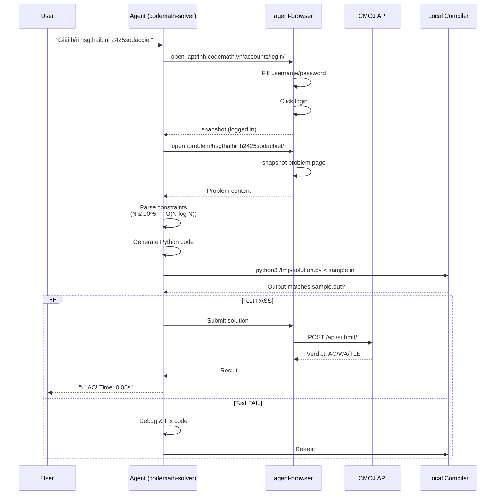

# 🚀 Bộ Skill Tự Động Hóa Giải Bài Tập Competitive Programming

Bộ công cụ AI agent **đầu tiên tại Việt Nam** chuyên biệt hóa cho việc giải và giảng dạy bài tập lập trình thi đấu trên nền tảng [CMOJ - CodeMath Online Judge](https://laptrinh.codemath.vn).


---

## 🎬 Video Demo

Xem video demo cách hoạt động của bộ skill:

<p align="center">
  <a href="https://www.youtube.com/watch?v=xFSjslQnbXg">
    
  </a>
</p>

---

## 📑 Mục Lục

- [🎯 Giới Thiệu](#-giới-thiệu)
- [🧠 Kiến Trúc Hệ Thống](#-kiến-trúc-hệ-thống)
- [📦 Bộ 3 Skills](#-bộ-3-skills)
  - [1. 🤖 CodeMath Solver](#1--codemath-solver---tay-code-tự-động)
  - [2. 🧠 CP Solver](#2--cp-solver---chuyên-gia-phân-tích-thuật-toán)
  - [3. 🎓 CP Teacher](#3--cp-teacher---giảng-viên-ảo)
- [🛠 Cài Đặt Tool Phụ Trợ](#-cài-đặt-tool-phụ-trợ)
- [🚀 Quick Start](#-quick-start)
- [📊 So Sánh 3 Skills](#-so-sánh-3-skills)
- [🏗 Kiến Trúc Kỹ Thuật](#-kiến-trúc-kỹ-thuật)
- [📁 Cấu Trúc Repository](#-cấu-trúc-repository)
- [🎓 Use Cases Thực Tế](#-use-cases-thực-tế)
- [⚠️ Lưu Ý Quan Trọng](#-lưu-ý-quan-trọng)
- [🤝 Đóng Góp](#-đóng-góp)
- [📄 License](#-license)
- [📞 Liên Hệ](#-liên-hệ)

---

## 🎯 Giới Thiệu

Bạn là sinh viên muốn **học CP hiệu quả**? Giảng viên cần **tạo bài giảng nhanh**? Thí sinh muốn **luyện tập thông minh**?

Bộ 3 skills này được thiết kế để **tự động hóa toàn bộ quy trình** từ giải bài → phân tích → giảng dạy, giúp bạn:

- ✅ **Tiết kiệm 80% thời gian** giải bài tập
- ✅ **Hiểu sâu thuật toán** qua bài giảng chi tiết 500+ dòng
- ✅ **Luyện tập thông minh** với contest auto-solver
- ✅ **Không bao giờ bỏ cuộc** trước TLE/WA

---

## 🧠 Kiến Trúc Hệ Thống

```
┌────────────────────────────────────────────────────────────────────┐
│                    USER REQUEST (Natural Language)                 │
│   "Giải bài hsgthaibinh2425sodacbiet" / "Tạo bài giảng bài này"   │
└────────────────────────────┬───────────────────────────────────────┘
                             │
                             ▼
┌────────────────────────────────────────────────────────────────────┐
│                      SKILL ROUTER (Thông minh)                     │
│  Phân loại yêu cầu → Chọn skill phù hợp                            │
└────────────────────────────┬───────────────────────────────────────┘
                             │
        ┌────────────────────┼────────────────────┐
        │                    │                    │
        ▼                    ▼                    ▼
┌───────────────┐  ┌────────────────┐  ┌──────────────────┐
│  CODEMATH     │  │    CP-SOLVER   │  │   CP-TEACHER     │
│  SOLVER       │  │    (Phân tích) │  │   (Bài giảng)    │
│               │  │                │  │                  │
│ • Giải bài    │  │ • Debug TLE    │  │ • Manual walk    │
│ • Tìm bài     │  │ • Optimize     │  │ • Line-by-line   │
│ • Auto contest│  │ • Stress test  │  │ • Why AC proof   │
│ • Retrieve AC │  │ • Algorithm    │  │ • Practice probs │
└───────┬───────┘  └────────┬───────┘  └────────┬─────────┘
        │                   │                    │
        └───────────────────┼────────────────────┘
                            │
                            ▼
┌────────────────────────────────────────────────────────────────────┐
│                    SHARED TOOLING LAYER                            │
│  ┌─────────────┐  ┌──────────────┐  ┌──────────────┐              │
│  │agent-browser│  │   defuddle   │  │ python3/g++  │              │
│  │(Automation) │  │(Web Reader)  │  │ (Compiler)   │              │
│  └─────────────┘  └──────────────┘  └──────────────┘              │
└────────────────────────────────────────────────────────────────────┘
                            │
                            ▼
┌────────────────────────────────────────────────────────────────────┐
│                    CMOJ PLATFORM                                   │
│  https://laptrinh.codemath.vn                                      │
│  • Problem Statements  • Submissions  • Contests  • Rankings       │
└────────────────────────────────────────────────────────────────────┘
```

---

## 📦 Bộ 3 Skills

### 1. 🤖 CodeMath Solver - "Tay Code Tự Động"

**Mô tả:** Skill tự động giải và submit bài tập trên CMOJ với 4 flows chính.

#### ⚡ 4 Flows Chính

```
┌─────────────────────────────────────────────────────────────────┐
│  FLOW A: GIẢI BÀI CỤ THỂ                                        │
├─────────────────────────────────────────────────────────────────┤
│  Login → Đọc đề → Sinh code → Test local → Submit → AC!        │
│                                                                 │
│  User: "Giải bài hsgthaibinh2425sodacbiet bằng Python"         │
│  → Agent tự động:                                               │
│     1. Login CMOJ                                               │
│     2. Fetch problem statement                                  │
│     3. Phân tích constraints → Chọn algorithm                   │
│     4. Generate code                                            │
│     5. Test với sample input                                    │
│     6. Submit (chờ approve)                                     │
│     7. Nếu TLE/WA → Lặp lại bước 3-6                            │
└─────────────────────────────────────────────────────────────────┘

┌─────────────────────────────────────────────────────────────────┐
│  FLOW B: TÌM & LỌC BÀI CHƯA GIẢI                                │
├─────────────────────────────────────────────────────────────────┤
│  Login → Filter → Parse table → Present → User chọn            │
│                                                                 │
│  User: "Tìm 10 bài chưa giải trong HSG Thái Bình"              │
│  → Agent:                                                       │
│     1. Login CMOJ                                               │
│     2. Filter theo category (HSG Thái Bình)                     │
│     3. Lọc unsolved_only=true                                   │
│     4. Sort by -ac_rate (khó nhất trước)                        │
│     5. Present danh sách 10 bài                                 │
└─────────────────────────────────────────────────────────────────┘

┌─────────────────────────────────────────────────────────────────┐
│  FLOW C: GIẢI NGUYÊN CONTEST                                    │
├─────────────────────────────────────────────────────────────────┤
│  Login → Parse contest → Loop Flow A cho từng bài              │
│                                                                 │
│  User: "Giải contest https://.../hsg2425quangtri"              │
│  → Agent:                                                       │
│     1. Login CMOJ                                               │
│     2. Fetch contest page                                       │
│     3. Parse problem IDs (A, B, C, D...)                        │
│     4. For each problem: Call Flow A                            │
│     5. Report progress: "Đã giải 5/10 bài, 3 AC, 2 WA"         │
└─────────────────────────────────────────────────────────────────┘

┌─────────────────────────────────────────────────────────────────┐
│  FLOW D: LẤY LẠI CODE ĐÃ AC                                     │
├─────────────────────────────────────────────────────────────────┤
│  Login → Submissions → Filter AC → Copy source                 │
│                                                                 │
│  User: "Lấy code bài hsghanoi2024catinh"                       │
│  → Agent:                                                       │
│     1. Login CMOJ                                               │
│     2. Navigate problem → My submissions                        │
│     3. Filter verdict=AC                                        │
│     4. Copy raw source code                                     │
│     5. Return code cho user                                     │
└─────────────────────────────────────────────────────────────────┘
```

#### 📊 Flow A - Chi Tiết Xử Lý



**📁 Tài liệu chi tiết:**
- [Flow A: Giải bài cụ thể](skills/codemath-solver/references/flow-a-solve.md)
- [Flow B: Tìm & lọc bài](skills/codemath-solver/references/flow-b-browse.md)
- [Flow C: Giải contest](skills/codemath-solver/references/flow-c-contest.md)
- [Flow D: Lấy code AC](skills/codemath-solver/references/flow-d-retrieve-ac.md)

---

### 2. 🧠 CP Solver - "Chuyên Gia Phân Tích Thuật Toán"

**Mô tả:** Chuyên gia PHÂN TÍCH và TỐI ƯU algorithm cho Competitive Programming.

#### 🎯 Khi Nào Dùng CP Solver?

| Dấu Hiệu | Action |
|----------|--------|
| Code bị **TLE 2+ lần** dù optimize | → `task: cp-solver` |
| Algorithm khó (**Segment Tree, Mo's, DP optimization**) | → `task: cp-solver` |
| User hỏi sâu ("**Tại sao TLE?**", "**Có cách nào tối ưu?**") | → `task: cp-solver` |
| Cần **stress testing** với test generation | → `task: cp-solver` |

#### ⚡ Flow Xử Lý

```
┌─────────────────────────────────────────────────────────────────┐
│  CP SOLVER ANALYSIS FLOW                                        │
├─────────────────────────────────────────────────────────────────┤
│  1. Fetch Problem Statement (defuddle.md)                      │
│     → Extract constraints, input/output format                 │
│                                                                 │
│  2. Analyze Current Solution                                    │
│     → Identify complexity O(...)                                │
│     → Find bottleneck (nested loops? recursion?)               │
│                                                                 │
│  3. Optimization Strategy                                       │
│     O(N²) → O(N log N): Sort + Binary Search                   │
│     O(N²) → O(N): Prefix sums, Two pointers                    │
│     Exponential → DP: Memoization                              │
│                                                                 │
│  4. Generate Optimized Code                                     │
│     → Fast I/O                                                  │
│     → Edge case handling                                        │
│     → Comments explaining key insights                         │
│                                                                 │
│  5. Return to Codemath-Solver                                   │
│     → Code mới + Complexity analysis                            │
│     → Submit → Report verdict                                   │
└─────────────────────────────────────────────────────────────────┘
```

#### 🔍 Debug Decision Tree

```
                    Verdict không AC
                         │
        ┌────────────────┼────────────────┐
        │                │                │
        ▼                ▼                ▼
      TLE              WA               RE
        │                │                │
        │                │                │
        ▼                ▼                ▼
  • Check complexity  • Re-read problem  • Check bounds
  • Find bottleneck   • Compute sample  • Division by zero
  • Optimize pattern    by hand          • Recursion depth
  • Change algorithm  • Edge cases      • Memory limit
                       (n=1, n=max)
```

**📁 Tài liệu chuyên sâu:**
- [Problem Analysis](skills/cp-solver/references/01-problem-analysis.md)
- [Algorithm Selection](skills/cp-solver/references/02-algorithm-selection.md)
- [Optimization Patterns](skills/cp-solver/references/03-optimization-patterns.md)
- [Debug Strategies](skills/cp-solver/references/05-debugging-strategies.md)

---

### 3. 🎓 CP Teacher - "Giảng Viên Ảo"

**Mô tả:** Biến bài toán CP đã AC thành **bài giảng chi tiết 500+ dòng**.

#### 🎯 Khi Nào Dùng CP Teacher?

- ✅ User đã AC một bài và muốn **hiểu sâu hơn**
- ✅ Giảng viên cần **tạo tài liệu giảng dạy**
- ✅ Học sinh muốn **có lời giải chi tiết** để học
- ✅ Trigger: `"biến bài này thành bài giảng"`, `"tạo lesson"`, `/cp-teach`

#### 📝 Cấu Trúc Bài Giảng (5 Modules)

```
┌─────────────────────────────────────────────────────────────────┐
│  BÀI GIẢNG: Sắp Xếp Chiếu - Đếm Số Đợt                         │
│  URL: https://laptrinh.codemath.vn/problem/...                 │
├─────────────────────────────────────────────────────────────────┤
│                                                                 │
│  MODULE 1: Problem Analysis (Phân tích bài toán)               │
│  ├── Đề bài (tóm tắt)                                          │
│  ├── Input/Output + Constraints                                │
│  └── Nhận diện dạng bài (Keywords → Category)                  │
│                                                                 │
│  MODULE 2: Solution Breakdown (Giải pháp chi tiết) ⭐          │
│  ├── 2.1 Manual Walkthrough (GIẢI THỦ CÔNG, KHÔNG CODE)       │
│  │   ├── Chọn test case cụ thể                                 │
│  │   ├── Giải từng bước trên giấy (ASCII art)                 │
│  │   └── Rút ra pattern                                        │
│  ├── 2.2 Code Explanation (Line-by-line)                       │
│  │   └── Mapping code với manual walkthrough                   │
│  └── 2.3 Why AC? (Proof + Complexity)                          │
│                                                                 │
│  MODULE 3: Key Takeaways (Bài học tổng quát)                   │
│  ├── Kinh nghiệm nhận diện                                     │
│  ├── Pattern cần nhớ (template code)                           │
│  ├── Sai lầm thường gặp (❌ SAI / ✅ ĐÚNG)                      │
│  └── Tips & Tricks                                             │
│                                                                 │
│  MODULE 4: Theory Extension (OPTIONAL)                         │
│  └── Chuyên đề mở rộng (nếu có)                                │
│                                                                 │
│  MODULE 5: Practice Problems (Bài tập tương tự)                │
│  ├── Dễ ⭐ (1-2 bài)                                            │
│  ├── Trung bình ⭐⭐ (2-3 bài)                                   │
│  └── Khó ⭐⭐⭐ (1-2 bài)                                         │
│                                                                 │
└─────────────────────────────────────────────────────────────────┘
```

#### 🎨 Example Output Snippet

```markdown
## 2.1. Mô phỏng thủ công (KHÔNG DÙNG CODE)

**Test case:** N=5, dãy = [3, 1, 4, 2, 5]

**Bước 1: Phân tích yêu cầu**
- Cần chọn đủ các phiếu 1, 2, 3, 4, 5 theo thứ tự
- Mỗi đợt: đi từ trái sang phải, chọn phiếu tiếp theo nếu gặp

**Bước 2: Làm thử trên giấy**
```
Dãy: [3, 1, 4, 2, 5]
     ^  ^  ^  ^  ^
     0  1  2  3  4  (vị trí)

Đợt 1:
- Bắt đầu từ vị trí 0
- Cần phiếu 1 → gặp ở vị trí 1 ✓ (đang ở vị trí 1)
- Cần phiếu 2 → gặp ở vị trí 3 ✓ (đang ở vị trí 3)
- Cần phiếu 3 → vị trí 0 ✗ (ĐÃ QUA MẤT RỒI!)
→ Kết thúc đợt 1, đã chọn: 1, 2

Đợt 2:
- Bắt đầu lại từ vị trí 0
- Cần phiếu 3 → gặp ở vị trí 0 ✓
- Cần phiếu 4 → gặp ở vị trí 2 ✓
- Cần phiếu 5 → gặp ở vị trí 4 ✓
→ Kết thúc đợt 2, đã chọn: 3, 4, 5

Tổng: 2 đợt ✅
```

**Bước 3: Rút ra pattern**
- Nhận xét: Đợt mới cần khi phiếu tiếp theo nằm TRƯỚC vị trí hiện tại
- Pattern: `pos[i] < pos[i-1]` → cần đợt mới
```

#### 📤 Export Formats

Bài giảng có thể export sang:
- **Markdown (.md)** - Default, dễ đọc
- **PDF (.pdf)** - Professional, in ấn (qua Pandoc)
- **Word (.docx)** - Chỉnh sửa được
- **HTML (.html)** - Web-friendly
- **LaTeX (.tex)** - Typography cao cấp

**📁 Tài liệu:**
- [CP Teacher Skill](skills/cp-teacher/SKILL.md)

---

## 🛠 Cài Đặt Tool Phụ Trợ

### 1. Agent Browser (BẮT BUỘC)

**Agent Browser** là tool tự động hóa thao tác với browser (mở trang, click, fill form, snapshot).

#### Cài đặt:

```bash
# Cài đặt qua npm (recommended)
npm install -g agent-browser

# Hoặc dùng npx (không cần cài)
npx agent-browser --version

# Verify installation
agent-browser --help
```

#### Cấu hình:

```bash
# Set Chrome path (nếu không tự detect)
export AGENT_BROWSER_CHROME_PATH="/Applications/Google Chrome.app/Contents/MacOS/Google Chrome"

# Set headless mode (cho server/CI)
export AGENT_BROWSER_HEADLESS=true
```

#### Test nhanh:

```bash
# Mở trang web
agent-browser open https://laptrinh.codemath.vn/

# Chụp snapshot
agent-browser snapshot -i
```

**📁 Docs:** [Agent Browser GitHub](https://github.com/anthropics/agent-browser)

---

### 2. Defuddle (Đọc Nội Dung Web)

**Defuddle** là tool đọc nội dung trang web, loại bỏ clutter (ads, navigation) để lấy content sạch.

#### Cài đặt:

```bash
# Defuddle là API service, không cần cài
# Dùng trực tiếp qua curl:

curl https://defuddle.md/laptrinh.codemath.vn/problem/hsgthaibinh2425sodacbiet
```

#### Usage Pattern:

```bash
# ✅ CORRECT: Đọc problem statement
curl https://defuddle.md/laptrinh.codemath.vn/problem/<slug>

# ✅ CORRECT: Đọc submissions
curl https://defuddle.md/laptrinh.codemath.vn/problem/<slug>/submissions/<username>

# ❌ WRONG: Không dùng browser snapshot để đọc content
```

#### Integration với Skills:

```python
# Trong skill code
import subprocess

def fetch_problem(slug):
    result = subprocess.run(
        ["curl", f"https://defuddle.md/laptrinh.codemath.vn/problem/{slug}"],
        capture_output=True,
        text=True
    )
    return result.stdout
```

---

### 3. Python3 & G++ (Compiler)

```bash
# macOS
brew install python3 gcc

# Ubuntu/Debian
sudo apt-get install python3 g++

# Verify
python3 --version
g++ --version
```

---

## 🚀 Quick Start

### Ví dụ 1: Giải một bài cụ thể

```
User: Giải bài https://laptrinh.codemath.vn/problem/hsgthaibinh2425sodacbiet

→ Agent (codemath-solver) sẽ:
1. Login CMOJ
2. Fetch problem statement
3. Phân tích constraints (N ≤ 10^5 → O(N log N))
4. Generate Python code
5. Test với sample input
6. Submit → Report verdict
```

### Ví dụ 2: Tìm bài để luyện

```
User: Tìm 10 bài HSG Thái Bình chưa giải, khó nhất trước

→ Agent (codemath-solver) sẽ:
1. Login CMOJ
2. Filter category="HSG Thái Bình"
3. unsolved_only=true
4. order_by="-ac_rate"
5. Present danh sách 10 bài
```

### Ví dụ 3: Tạo bài giảng

```
User: Biến bài này thành bài giảng
URL: https://laptrinh.codemath.vn/problem/hsgnamdinh2223sapxepchieu

→ Agent (cp-teacher) sẽ:
1. Fetch problem statement
2. Manual walkthrough (giải thủ công)
3. Generate 500+ dòng bài giảng
4. Export PDF/Markdown
5. Lưu vào ~/Desktop/cp-teacher-lessons/
```

---

## 📊 So Sánh 3 Skills

| Tính Năng | CodeMath Solver | CP Solver | CP Teacher |
|-----------|-----------------|-----------|------------|
| **Mục đích** | Auto giải & submit | Phân tích & optimize | Tạo bài giảng |
| **Output** | AC verdict | Optimized code | 500+ dòng lesson |
| **Browser** | ✅ Tương tác nhiều | ⚠️ Chỉ đọc đề | ❌ Không dùng |
| **Compiler** | ✅ Test local | ✅ Stress test | ❌ Không cần |
| **Khi nào dùng** | "Giải bài này" | "Tại sao TLE?" | "Giảng chi tiết" |

---

## 🏗 Kiến Trúc Kỹ Thuật

### Flow Tổng Quát

```
┌──────────────────────────────────────────────────────────────┐
│                    USER INPUT                                │
│  "Giải bài <slug>" / "Tối ưu code này" / "Tạo lesson"       │
└────────────────────┬─────────────────────────────────────────┘
                     │
                     ▼
┌──────────────────────────────────────────────────────────────┐
│  SKILL SELECTION (Routing)                                   │
│                                                              │
│  • Mention "codemath", "CMOJ", "laptrinh.codemath.vn"       │
│    → codemath-solver                                         │
│  • Mention "phân tích", "tối ưu", "tại sao TLE"             │
│    → cp-solver                                               │
│  • Mention "bài giảng", "lesson", "giảng chi tiết"          │
│    → cp-teacher                                              │
└────────────────────┬─────────────────────────────────────────┘
                     │
                     ▼
┌──────────────────────────────────────────────────────────────┐
│  TOOL EXECUTION LAYER                                        │
│                                                              │
│  ┌────────────────┐  ┌──────────────┐  ┌────────────────┐   │
│  │ agent-browser  │  │   defuddle   │  │ python3 / g++  │   │
│  │                │  │              │  │                │   │
│  │ • open URL     │  │ • curl       │  │ • compile      │   │
│  │ • snapshot     │  │   defuddle.md│  │ • run          │   │
│  │ • fill form    │  │   /URL       │  │ • test         │   │
│  │ • click        │  │              │  │                │   │
│  └────────────────┘  └──────────────┘  └────────────────┘   │
└────────────────────┬─────────────────────────────────────────┘
                     │
                     ▼
┌──────────────────────────────────────────────────────────────┐
│  CMOJ PLATFORM                                               │
│  • Problem pages                                             │
│  • Submission API                                            │
│  • Contest pages                                             │
│  • User profiles                                             │
└──────────────────────────────────────────────────────────────┘
```

### Data Flow: Codemath Solver → CP Solver

```
┌─────────────────┐         TLE/WA          ┌─────────────────┐
│  codemath-solver│  ────────────────────>  │   cp-solver     │
│                 │                         │                 │
│  • Submit code  │                         │  • Analyze      │
│  • Get TLE      │                         │  • Optimize     │
│                 │                         │  • Return code  │
└─────────────────┘  <────────────────────  └─────────────────┘
                     Optimized code
                     
Handoff JSON:
{
  "problem_slug": "hsgthaibinh2425sodacbiet",
  "current_code": "...",
  "verdict": "TLE",
  "constraints": "N ≤ 10^5",
  "current_complexity": "O(N²)"
}
```

---

## 📁 Cấu Trúc Repository

```
codemath-skills/
├── skills/
│   ├── codemath-solver/
│   │   ├── SKILL.md                    # Skill definition
│   │   ├── README.md                   # This file
│   │   ├── references/                 # Deep-dive docs
│   │   │   ├── flow-a-solve.md
│   │   │   ├── flow-b-browse.md
│   │   │   ├── flow-c-contest.md
│   │   │   ├── flow-d-retrieve-ac.md
│   │   │   ├── escalation.md
│   │   │   └── ...
│   │   ├── templates/                  # Code templates
│   │   └── evals/                      # Evaluation tests
│   │
│   ├── cp-solver/
│   │   ├── SKILL.md
│   │   ├── README.md
│   │   ├── references/
│   │   │   ├── 01-problem-analysis.md
│   │   │   ├── 02-algorithm-selection.md
│   │   │   ├── 03-optimization-patterns.md
│   │   │   ├── 04-advanced-algorithms.md
│   │   │   ├── 05-debugging-strategies.md
│   │   │   └── 06-test-generation.md
│   │   └── patterns/
│   │       ├── number-theory.md
│   │       ├── dp.md
│   │       ├── graph.md
│   │       └── ...
│   │
│   └── cp-teacher/
│       ├── SKILL.md
│       ├── README.md
│       ├── scripts/
│       │   └── export_lesson.py        # Pandoc export
│       └── outputs/                    # Generated lessons
│
└── README.md                           # Root README
```

---

## 🎓 Use Cases Thực Tế

### 1. Sinh Viên Luyện Thi

**Scenario:** Chuẩn bị thi HSG, cần luyện 50 bài trong 2 tuần.

**Workflow:**
```
Ngày 1:
→ Flow B: Tìm 20 bài HSG các tỉnh chưa giải
→ Flow A: Giải từng bài (auto test + submit)
→ Nếu TLE: Escalate sang CP Solver để optimize
→ Sau khi AC: Dùng CP Teacher tạo lesson để học sâu
```

**Kết quả:** 
- ✅ Giải 20 bài trong 3 ngày (thay vì 2 tuần)
- ✅ Hiểu sâu algorithm qua bài giảng
- ✅ Có tài liệu ôn tập PDF

---

### 2. Giảng Viên Tạo Đề Cương

**Scenario:** Cần tạo 10 bài giảng cho môn "Thuật Toán Nâng Cao".

**Workflow:**
```
Bước 1: Chọn 10 bài kinh điển (HSG Quốc Gia, Olympic)
Bước 2: Với mỗi bài:
  → Dùng CP Teacher: "Biến bài này thành bài giảng"
  → Export PDF: python3 export_lesson.py lesson.md --formats pdf
Bước 3: Compile thành sách bài tập
```

**Kết quả:**
- ✅ 10 bài giảng 500+ dòng mỗi bài
- ✅ Đầy đủ: Manual walkthrough, Code explanation, Practice problems
- ✅ Export PDF đẹp với LaTeX formulas

---

### 3. Thí Thủ Auto-Contest

**Scenario:** Contest đêm nay, 5 bài, 3 giờ.

**Workflow:**
```
Trước contest:
→ Flow C: "Giải contest <URL>"
→ Agent auto: Parse 5 bài → Loop Flow A
→ Report: "Đã giải 3/5 bài (2 AC, 1 WA), còn 2 bài khó cần review"

Trong contest:
→ Review 2 bài còn lại với CP Solver
→ Submit manual
```

**Kết quả:**
- ✅ Tiết kiệm 2 giờ cho bài dễ
- ✅ Tập trung time cho bài khó
- ✅ Rank cao hơn

---

## ⚠️ Lưu Ý Quan Trọng

### 1. Không Submit Bừa

```yaml
Submit Policy:
  - ✅ Pass sample tests: Tất cả test cases từ đề phải đúng
  - ✅ Pass edge cases: N=0, N=1, max N, tất cả giống nhau
  - ✅ Complexity hợp lệ: Đã tính và xác nhận complexity phù hợp
  - ✅ Stress test: Ít nhất 200 random tests không có WA
  - ✅ Fast I/O: Đã bật (nếu N ≥ 10^4)
  
  Retry limit: 3 lần. Sau 3 lần thất bại → Báo cáo + dừng.
```

### 2. Escalation Đúng Lúc

```
Đừng cố optimize nếu:
❌ Algorithm khó (Segment Tree, Mo's, DP optimization)
❌ TLE 2+ lần dù đã thử nhiều cách
❌ Không hiểu tại sao WA

→ Delegate sang CP Solver ngay!
```

### 3. Defuddle.md Best Practices

```bash
# ✅ CORRECT
curl https://defuddle.md/laptrinh.codemath.vn/problem/<slug>

# ❌ WRONG
agent-browser open <URL> && agent-browser snapshot  # Chậm, không cần thiết
```

---

## 🤝 Đóng Góp

Chúng tôi chào đón mọi đóng góp!

### Cách đóng góp:

1. **Fork repo**
2. **Tạo branch:** `git checkout -b feature/your-feature`
3. **Commit changes:** `git commit -m "Add your feature"`
4. **Push:** `git push origin feature/your-feature`
5. **Open Pull Request**

### Cần giúp gì?

- 📝 Viết thêm references docs
- 🧪 Tạo evaluation tests
- 🎨 Improve lesson templates
- 🐛 Bug fixes

---

## 📄 License

MIT License - Tự do sử dụng cho mục đích học tập và nghiên cứu.

---

## 📞 Liên Hệ

- **Email:** hnkhang.dev@gmail.com

---

## 🙏 Lời Cảm Ơn

- [CMOJ - CodeMath Online Judge](https://laptrinh.codemath.vn) - Nền tảng OJ tuyệt vời
- [Agent Browser](https://github.com/anthropics/agent-browser) - Tool automation browser
- [Defuddle](https://defuddle.md) - Web content reader

---

**Made with ❤️**

*"Tự động hóa để học sâu hơn, không phải để học ít đi"*
